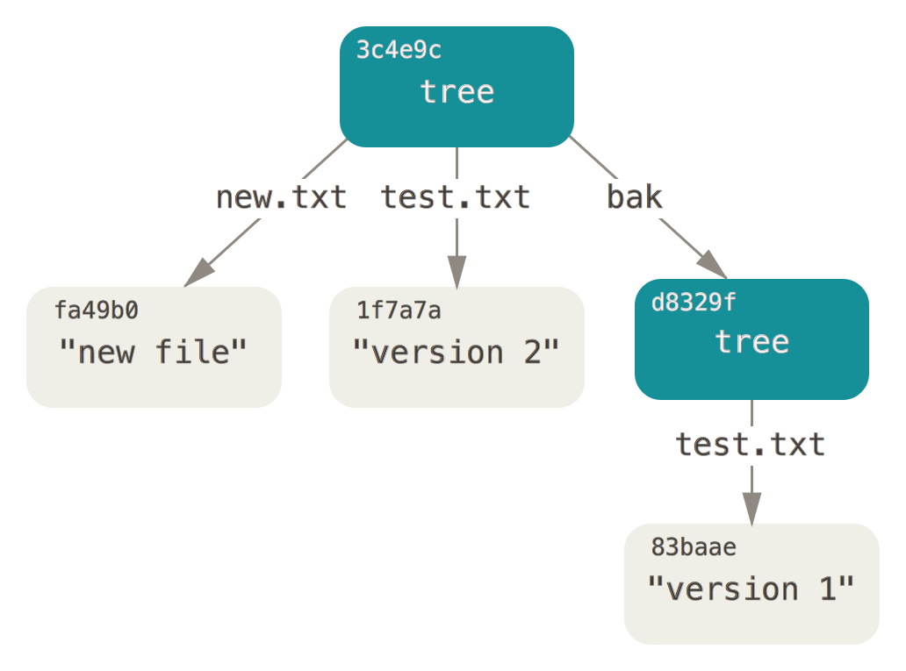
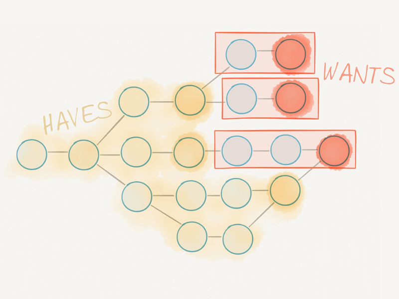
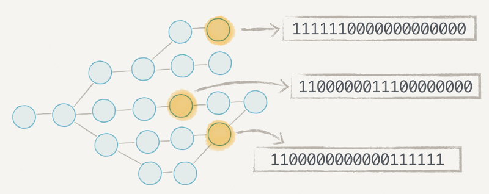

克隆仓库时有一个仓库在`Counting objects`上花费很多时间

```
#查看仓库打包文件
git verify-pack -v .git/objects/pack/pack-91f83026b5ee9dcfcc0c958a07d39548b86c7852.idx
#发现仓库depth达到了几千
chain length = 4659: 1 object
chain length = 4670: 1 object
chain length = 4671: 1 object
.git/objects/pack/pack-91f83026b5ee9dcfcc0c958a07d39548b86c7852.pack: ok
#仓库tree对象不断对上一个提交的tree对象进行delta存储
#显示格式为SHA-1 type size size-in-packfile offset-in-packfile depth base-SHA-1
078598787b00cfd319a2707143053e9e5484a4d6 tree   9 20 4393 4670 53c912e38b99400910cc45ff21655a022b1f59d9
3905dbfcf479c09ccba99e996283cfb6fc4f24c6 tree   8 19 4413 4671 53c912e38b99400910cc45ff21655a022b1f59d9
```

### git 对象

> Git 是一个内容寻址文件系统。看起来很酷， 但这是什么意思呢？
> 这意味着，Git 的核心部分是一个简单的键值对数据库（key-value data store）。
> 你可以向该数据库插入任意类型的内容，它会返回一个键值，通过该键值可以在任意时刻再次检索（retrieve）该内容。
> 可以通过底层命令 hash-object 来演示上述效果——该命令可将任意数据保存于 .git 目录，并返回相应的键值。
> git 仓库中有`Commits`,`Trees`,`Blobs`和`Tags`对象．一个树对象可以包含了一条或多条树对象记录（tree entry），
> 每条记录含有一个指向数据对象或者子树对象的 SHA-1 指针，以及相应的模式、类型、文件名信息。


猜测形成这样的仓库的原因是，不断向仓库添加新的文件,而之前的 tree 对象没有改变，形成 depth 很深的 tree．

### github 清点对象算法

`git clone`和`git fetch`操作都需要清点对象，因为需要知道，到底需要下载哪些对象。对于大型代码库来说，计算这么多 commit 中的对象需要很多时间和服务器资源.



#### Github 团队想到的新算法，是建立一个 Bitmap 索引，即为每一个 commit 生成一个二进制值。

> bitmap 使用二进制值代表这些对象。有多少个对象，这个二进制值就有多少位。它的第 n 位，就代表数据文件里面的第 n 个对象。
> 每个 commit 都会有一个对应的二进制值，表示当前快照包含的所有对象。这些对象对应的二进制位都为 1，其他二进制位都为 0。
> Github 的生产环境已经部署了这套算法，用户再也不用为了清点对象，而苦苦等待了。而且，Github 团队还把它合并进了 Git，这意味着，从此所有 Git 实现都可以使用 Bitmap 功能了，建议服务器 git 版本为`2.5.0`或者以后



### 解决方法

- 在 gerrit 页面上进行`gc`,会生成`bitmap`文件

```
ls ./objects/pack/
pack-39b8cea1cc0e6c22b5b7d7d28cfdfa3d07bd05ea.bitmap
pack-39b8cea1cc0e6c22b5b7d7d28cfdfa3d07bd05ea.idx
pack-39b8cea1cc0e6c22b5b7d7d28cfdfa3d07bd05ea.pack
```

- 在服务器的仓库中手动生成`bitmap`文件

```
git repack -a --window=10 --depth=50 --write-bitmap-index
#需要清除gerrit缓存,才会生效
ssh -p 29418 admin@localhost gerrit flush-caches
```

- 在服务器上更改对象打包的`depth`

```
#git gc一般只是收集有用的松散对象并将它们存入 packfile
#--aggressive主动重新打包，更改仓库delta深度
git gc --aggressive
#需要重启gerrit服务器
./bin/gerrit.sh restart
#配置
git config --global gc.aggressiveDepth 250
git config --global gc.aggressiveWindow 250
git config --global gc.pruneExpire never
```

- [Git 内部原理 - Git 对象](http://git-scm.com/book/zh/v2/Git-%E5%86%85%E9%83%A8%E5%8E%9F%E7%90%86-Git-%E5%AF%B9%E8%B1%A1)
- [Github 的清点对象算法](http://www.ruanyifeng.com/blog/2015/09/git-bitmap.html)
- [Git 内部原理 - 传输协议](http://git-scm.com/book/zh/v2/Git-%E5%86%85%E9%83%A8%E5%8E%9F%E7%90%86-%E4%BC%A0%E8%BE%93%E5%8D%8F%E8%AE%AE)
- [Bitmap 的解释](https://github.com/gitster/git/commit/fff4275)
- [bitma 格式](https://github.com/gitster/git/blob/master/Documentation/technical/bitmap-format.txt)
