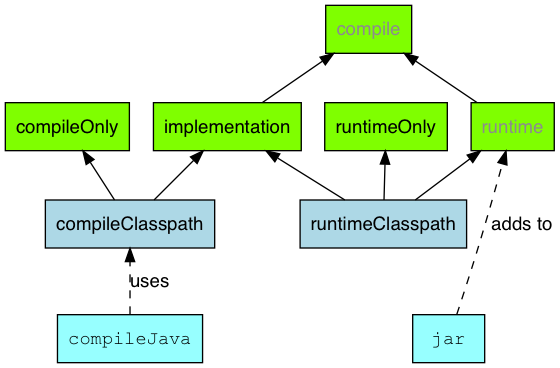
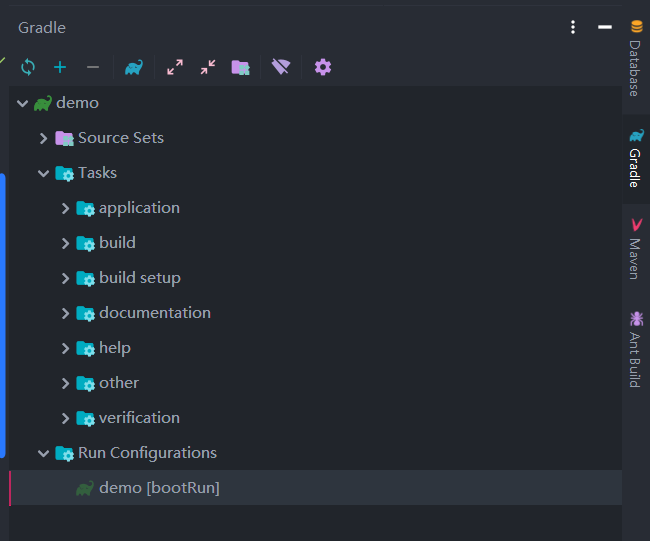
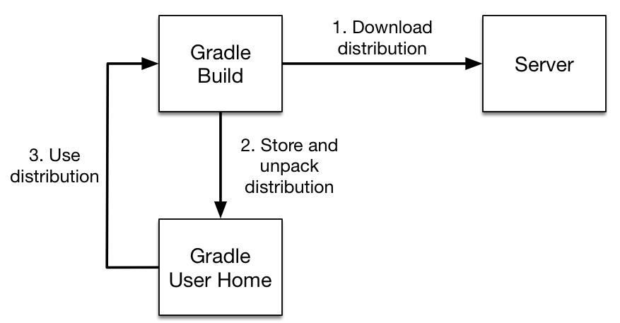
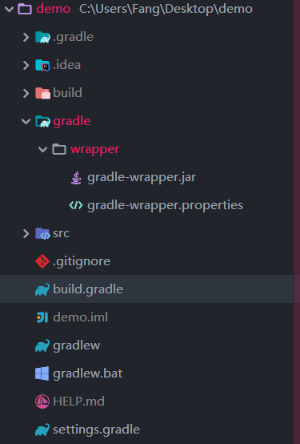

### 参考
- [https://gradle.org/](https://gradle.org/)
- [https://github.com/gradle/gradle](https://github.com/gradle/gradle)
- [gradle_wrapper](https://docs.gradle.org/current/userguide/gradle_wrapper.html)
- [gradle guide](https://docs.gradle.org/current/userguide/userguide_single.html)
- [spring gradle-plugin](https://docs.spring.io/spring-boot/docs/current/gradle-plugin/reference/html/)
#### 1. Gradle简介

> Accelerate developer productivity

官网上可以看到gradle设计目标是提升开发者效率

#### 2. Gradle安装
java环境需要JDK/JRE版本1.8或者以上
```
$ java -version
java version "1.8.0_191"
```
在官网上下载安装包[gradle](https://gradle.org/install/)
加入到环境变量中
```
export gradle_HOME=/usr/local/gradle-5.4.1
export PATH=$PATH:$gradle_HOME
```
```
$ gradle -v

Welcome to Gradle 5.4.1!
```

#### 3.1 Hello world
你可以通过在命令行运行`gradle`命令来执行构建，
`gradle`命令会从当前目录下寻找`build.gradle`文件来执行构建。
我们称`build.gradle`文件为构建脚本。

编辑`build.gradle`文件
```
task hello {
    doLast {
        println 'Hello world!'
    }
}
```
#### 3.2 [添加依赖任务](https://docs.gradle.org/current/userguide/userguide_single.html#tutorial_using_tasks)
```
task taskX {
    dependsOn 'taskY'
    doLast {
        println 'taskX'
    }
}
task taskY {
    doLast {
        println 'taskY'
    }
}
```
```
$ gradle -q taskX
taskY
taskX
```
#### 3.3 构建脚本添加依赖
```
import org.apache.commons.codec.binary.Base64

buildscript {
    repositories {
        mavenCentral()
    }
    dependencies {
        classpath group: 'commons-codec', name: 'commons-codec', version: '1.2'
    }
}

task encode {
    doLast {
        def byte[] encodedString = new Base64().encode('hello world\n'.getBytes())
        println new String(encodedString)
    }
}
```
```
$ gradle -q encode
aGVsbG8gd29ybGQK
```
### 4. 常用插件
#### 4.1.1 [Java插件](https://docs.gradle.org/current/userguide/userguide_single.html#java_plugin)
```
plugins {
    id 'java'
}

sourceCompatibility = '1.8'
targetCompatibility = '1.8'
version = '1.2.1'
```
#### 4.1.2 Java插件中的任务
|任务名称|依赖的任务|说明|
|-----------|------------------|---------------|
|compileJava| |Compiles production Java source files using the JDK compiler.|
|processResources ||Copies production resources into the production resources directory.|
|classes|compileJava, processResources|This is an aggregate task that just depends on other tasks.|
|compileTestJava |classes|Compiles test Java source files using the JDK compiler.|
|processTestResources ||Copies test resources into the test resources directory.|
|testClasses|compileTestJava, processTestResources|This is an aggregate task that just depends on other tasks.|
|jar|classes|Assembles the production JAR file, based on the classes and resources attached to the main source set.|
|javadoc|classes|Generates API documentation for the production Java source using Javadoc.|
|test|testClasses|Runs the unit tests using JUnit or TestNG.|
|clean||Deletes the project build directory.|

#### 4.1.3 Java插件中的工程的生命周期
`java`插件添加的这些任务组成了工程的生命周期。

|生命周期名称|依赖的任务|说明|
|-----------|------------------|---------------|
|assemble|jar|Aggregate task that assembles all the archives in the project. |
|check|test|Aggregate task that performs verification tasks, such as running the tests. |
|build|check, assemble|Aggregate tasks that performs a full build of the project. |


#### 4.1.4 Java插件中默认项目结构
约定大于配置，通常java约定项目结构如下

|目录|说明|
|-------------|----------------|
|src/main/java|Production Java source.|
|src/main/resources|Production resources, such as XML and properties files.|
|src/test/java|Test Java source.|
|src/test/resources|Test resources.|

#### 4.1.5 Java插件中依赖管理
|依赖名称|说明|
|--------------|------------------|
|compile(Deprecated)|Compile time dependencies. Superseded by implementation.|
|implementation extends compile|Implementation only dependencies.|
|compileOnly|Compile time only dependencies, not used at runtime.|
|compileClasspath extends compile, compileOnly, implementation|Compile classpath, used when compiling source. Used by task compileJava.|
|annotationProcessor|Annotation processors used during compilation.|
|runtime(Deprecated) extends compile|Runtime dependencies. Superseded by runtimeOnly.|
|runtimeOnly|Runtime only dependencies.|
|testCompile(Deprecated) extends compile|Additional dependencies for compiling tests. Superseded by testImplementation.|
|testImplementation extends testCompile, implementation|Implementation only dependencies for tests.|
|testCompileOnly|Additional dependencies only for compiling tests, not used at runtime.|
|testCompileClasspath extends testCompile, testCompileOnly, testImplementation|Test compile classpath, used when compiling test sources. Used by task compileTestJava.|
|testRuntime(Deprecated) extends runtime, testCompile|Additional dependencies for running tests only. Superseded by testRuntimeOnly.|
|testRuntimeOnly extends runtimeOnly|Runtime only dependencies for running tests.|
|testRuntimeClasspath extends testRuntimeOnly, testRuntime, testImplementation|Runtime classpath for running tests. Used by task test.|


#### 4.1.6 依赖仓库
```
repositories {
    mavenLocal()
    maven { url 'http://maven.aliyun.com/nexus/content/groups/public/' }
    mavenCentral()
    maven { url "http://repo.spring.io/release" }
}
```
#### 4.2 `io.spring.dependency-management`插件
> 当应用`io.spring.dependency-management`插件的时候，
`org.springframework.boot`插件将自动从使用的`org.springframework.boot`版本导入`spring-boot-dependencies`，
你可以省略声明依赖的版本号。
```
dependencies {
	implementation 'org.springframework.boot:spring-boot-starter-web'
	testImplementation 'org.springframework.boot:spring-boot-starter-test'
}
```
### 5. [start.spring.io](https://start.spring.io/)生成的`build.gradle`文件
```
plugins {
	id 'org.springframework.boot' version '2.1.5.RELEASE'
	id 'java'
}

apply plugin: 'io.spring.dependency-management'

group = 'com.example'
version = '0.0.1-SNAPSHOT'
sourceCompatibility = '1.8'

configurations {
	compileOnly {
		extendsFrom annotationProcessor
	}
}

repositories {
	mavenCentral()
}

dependencies {
	implementation 'org.springframework.boot:spring-boot-starter-web'
	compileOnly 'org.projectlombok:lombok'
	runtimeOnly 'mysql:mysql-connector-java'
	annotationProcessor 'org.projectlombok:lombok'
	testImplementation 'org.springframework.boot:spring-boot-starter-test'
}
```
#### 6. Idea


### 7. Gradle Wrapper


#### 7.1 给项目添加`gradle wrapper`
```
$ gradle wrapper

BUILD SUCCESSFUL in 4s
1 actionable task: 1 executed
```
`gradle wraper`会在工程上添加`gradle`目录、`gradlew`和`gradlew.bat`文件



- `build`目录是`gradle`构建生成的目录，编译好的jar包在`build/libs`目录
- `gradle-wrapper.jar`用于下载Gradle文件。
- `Gradle Wrapper`的作用是简化Gradle本身的安装、部署。不同版本的项目可能需要不同版本的Gradle，
手工部署的话比较麻烦，而且可能产生冲突，所以需要`Gradle Wrapper`帮你搞定这些事情。
`Gradle Wrapper`是Gradle项目的一部分。
- `gradlew与gradlew.bat`: `gradlew`为Linux下的shell脚本，`gradlew.bat`是Windows下的批处理文件。
`gradlew`是`gradle wrapper`的缩写，也就是说它对gradle的命令进行了包装

> Gradle对应版本下载完成之后，Gradle Wrapper的使命基本完成了，Gradle会读取build.gradle文件

`gradle/wrapper/gradle-wrapper.properties`文件内容
```
distributionBase=GRADLE_USER_HOME
distributionPath=wrapper/dists
distributionUrl=https\://services.gradle.org/distributions/gradle-5.4.1-bin.zip
zipStoreBase=GRADLE_USER_HOME
zipStorePath=wrapper/dists
```
其中`GRADLE_USER_HOME`一般指`~/.gradle`,从配置文件中可以知道我要使用gradle-5.4.1版本，
从`https\://services.gradle.org/distributions/gradle-5.4.1-bin.zip`下载，下载到本地的`~/.gradle/wrapper/dists`目录

#### 7.2 升级工程的gradle版本
```
$ ./gradlew wrapper --gradle-version 5.4.1

BUILD SUCCESSFUL in 4s
1 actionable task: 1 executed
```
