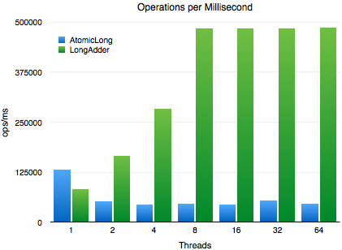

# LongAdder

## 参考

- [Java 多线程进阶（十七）—— J.U.C 之 atomic 框架：LongAdder](https://segmentfault.com/a/1190000015865714)
- [java-8-performance-improvements-longadder-vs-atomiclong](http://blog.palominolabs.com/2014/02/10/java-8-performance-improvements-longadder-vs-atomiclong/)

## LongAdder 简介

`JDK1.8`时，`java.util.concurrent.atomic`包中提供了一个新的原子类：`LongAdder`。
根据 Oracle 官方文档的介绍，`LongAdder`在高并发的场景下会比它的前辈--`AtomicLong` `具有更好的性能，代价是消耗更多的内存空间`

## 为什么要引入 LongAdder

我们知道，`AtomicLong`是利用了底层的 CAS 操作来提供并发性的，比如`incrementAndGet`方法：

```java
public class AtomicInteger extends Number implements java.io.Serializable {
    private static final long serialVersionUID = 6214790243416807050L;

    // setup to use Unsafe.compareAndSwapInt for updates
    private static final Unsafe unsafe = Unsafe.getUnsafe();
    private static final long valueOffset;

    private volatile int value;

    /**
     * Atomically increments by one the current value.
     *
     * @return the previous value
     */
    public final int getAndIncrement() {
        return unsafe.getAndAddInt(this, valueOffset, 1);
    }
}

public final class Unsafe {
    public final int getAndAddInt(Object var1, long var2, int var4) {
        int var5;
        do {
            var5 = this.getIntVolatile(var1, var2);
        } while(!this.compareAndSwapInt(var1, var2, var5, var5 + var4));

        return var5;
    }
}
```

`在并发量较低的环境下，线程冲突的概率比较小，自旋的次数不会很多`。

高并发环境下，N 个线程同时进行自旋操作，会出现大量失败并不断自旋的情况，此时`AtomicLong的自旋会成为瓶颈`。

这就是`LongAdder`引入的初衷——解决高并发环境下`AtomicLong`的自旋瓶颈问题。



## LongAdder 快在哪里

AtomicLong 中有个内部变量 value 保存着实际的 long 值，所有的操作都是针对该变量进行。也就是说，高并发环境下，value 变量其实是一个热点，也就是 N 个线程竞争一个热点。

LongAdder 的基本思路就是分散热点，将 value 值分散到一个数组中，不同线程会命中到数组的不同槽中，各个线程只对自己槽中的那个值进行 CAS 操作，这样热点就被分散了，冲突的概率就小很多。如果要获取真正的 long 值，只要将各个槽中的变量值累加返回。

## LongAdder 的内部结构

```java
public class LongAdder extends Striped64 implements Serializable {
    private static final long serialVersionUID = 7249069246863182397L;

    /**
     * Creates a new adder with initial sum of zero.
     */
    public LongAdder() {
    }

    /**
     * Adds the given value.
     *
     * @param x the value to add
     */
    public void add(long x) {
        Cell[] as; long b, v; int m; Cell a;
        if ((as = cells) != null || !casBase(b = base, b + x)) {
            boolean uncontended = true;
            if (as == null || (m = as.length - 1) < 0 ||
                (a = as[getProbe() & m]) == null ||
                !(uncontended = a.cas(v = a.value, v + x)))
                longAccumulate(x, null, uncontended);
        }
    }

    /**
     * Equivalent to {@code add(1)}.
     */
    public void increment() {
        add(1L);
    }

    public long sum() {
        Cell[] as = cells; Cell a;
        long sum = base;
        if (as != null) {
            for (int i = 0; i < as.length; ++i) {
                if ((a = as[i]) != null)
                    sum += a.value;
            }
        }
        return sum;
    }
}
```

```java
abstract class Striped64 extends Number {
        @sun.misc.Contended static final class Cell {
        volatile long value;
        Cell(long x) { value = x; }
        final boolean cas(long cmp, long val) {
            return UNSAFE.compareAndSwapLong(this, valueOffset, cmp, val);
        }

        // Unsafe mechanics
        private static final sun.misc.Unsafe UNSAFE;
        private static final long valueOffset;
        static {
            try {
                UNSAFE = sun.misc.Unsafe.getUnsafe();
                Class<?> ak = Cell.class;
                valueOffset = UNSAFE.objectFieldOffset
                    (ak.getDeclaredField("value"));
            } catch (Exception e) {
                throw new Error(e);
            }
        }
    }

    /** Number of CPUS, to place bound on table size */
    static final int NCPU = Runtime.getRuntime().availableProcessors();

    /**
     * Table of cells. When non-null, size is a power of 2.
     */
    transient volatile Cell[] cells;

    /**
     * Base value, used mainly when there is no contention, but also as
     * a fallback during table initialization races. Updated via CAS.
     */
    transient volatile long base;

    /**
     * Spinlock (locked via CAS) used when resizing and/or creating Cells.
     */
    transient volatile int cellsBusy;

    /**
     * Package-private default constructor
     */
    Striped64() {
    }
    /**
     * CASes the base field.
     */
    final boolean casBase(long cmp, long val) {
        return UNSAFE.compareAndSwapLong(this, BASE, cmp, val);
    }
}
```
