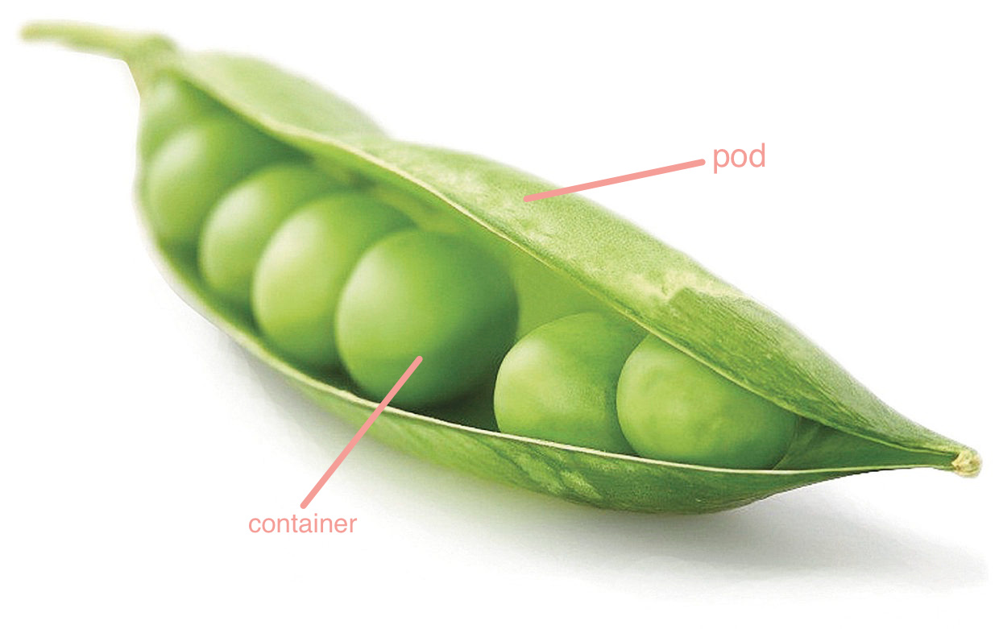

# 1.了解 Pod

Pod 是 Kubernetes 创建或部署的最小/最简单的基本单位，一个 Pod 代表集群上正在运行的一个进程。

一个 Pod 封装一个应用容器（也可以有多个容器），存储资源、一个独立的网络 IP 以及管理控制容器运行方式的策略选项。
Pod 代表部署的一个单位：Kubernetes 中单个应用的实例，它可能由单个容器或多个容器共享组成的资源。

之所以费功夫提供这一层封装，主要是因为容器推荐的用法是里面只运行一个进程，而一般情况下某个应用都由多个组件构成的。

pod 中所有的容器最大的特性也是最大的好处就是共享了很多资源，比如网络空间。
pod 下所有容器共享网络和端口空间，也就是它们之间可以通过 localhost 访问和通信，对外的通信方式也是一样的，省去了很多容器通信的麻烦。

除了网络之外，定义在 pod 里的 volume 也可以 mount 到多个容器里，以实现共享的目的。

## 2.Kubernetes 中的 Pod 使用可分两种主要方式：

- Pod 中运行一个容器。“one-container-per-Pod”模式是 Kubernetes 最常见的用法;
  在这种情况下，你可以将 Pod 视为单个封装的容器，但是 Kubernetes 是直接管理 Pod 而不是容器。
- Pods 中运行多个需要一起工作的容器。Pod 可以封装紧密耦合的应用，它们需要由多个容器组成，它们之间能够共享资源，

每个 Pod 都是运行应用的单个实例，如果需要水平扩展应用（例如，运行多个实例），则应该使用多个 Pods，每个实例一个 Pod。
在 Kubernetes 中，这样通常称为 Replication。Replication 的 Pod 通常由 Controller 创建和管理。

## 3.Pods 如何管理多个容器

Pod 中的容器在集群中 Node 上被自动分配，容器之间可以共享资源、网络和相互依赖关系，并同时被调度使用。

Pods 提供两种共享资源：网络和存储。

### 3.1 网络

每个 Pod 被分配一个独立的 IP 地址，Pod 中的每个容器共享网络命名空间，包括 IP 地址和网络端口。
Pod 内的容器可以使用 localhost 相互通信。当 Pod 中的容器与 Pod 外部通信时，他们必须协调如何使用共享网络资源（如端口）。

### 3.2 存储

Pod 可以指定一组共享存储 volumes。Pod 中的所有容器都可以访问共享 volumes，允许这些容器共享数据。
volumes 还用于 Pod 中的数据持久化，以防其中一个容器需要重新启动而丢失数据。有关 Kubernetes 如何在 Pod 中实现共享存储的更多信息，请参考 Volumes。

## 4.使用 Pod

你很少会直接在 kubernetes 中创建单个 Pod。因为 Pod 的生命周期是短暂的，用后即焚的实体。
当 Pod 被创建后（不论是由你直接创建还是被其他 Controller），都会被 Kuberentes 调度到集群的 Node 上。

Pod 不会自愈。如果 Pod 运行的 Node 故障，或者是调度器本身故障，这个 Pod 就会被删除。同样的，如果 Pod 所在 Node 缺少资源或者 Pod 处于维护状态，Pod 也会被驱逐。
Kubernetes 使用更高级的称为 Controller 的抽象层，来管理 Pod 实例。虽然可以直接使用 Pod，但是在 Kubernetes 中通常是使用 Controller 来管理 Pod 的。

## 5.Pod 和 Controller

Controller 可以创建和管理多个 Pod，提供副本管理、滚动升级和集群级别的自愈能力。
例如，如果一个 Node 故障，Controller 就能自动将该节点上的 Pod 调度到其他健康的 Node 上。
