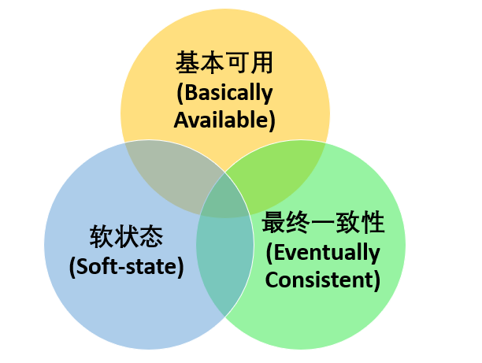
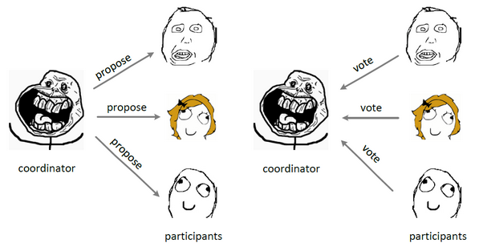
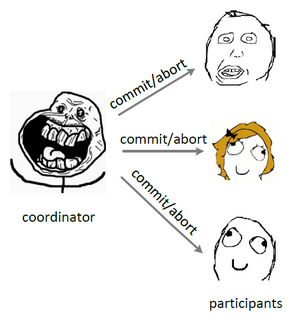
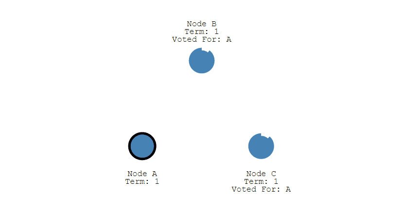
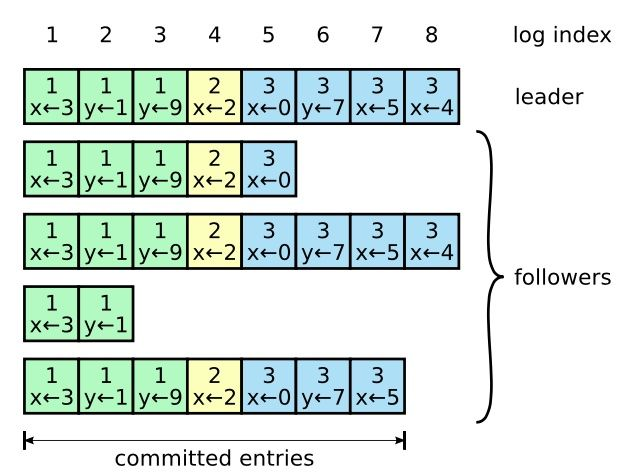

# 分布式一致性算法

## 参考

- [https://raft.github.io/](https://raft.github.io/)
- [https://raft.github.io/raftscope/index.html](https://raft.github.io/raftscope/index.html)
- [https://github.com/hua345/raftscope](https://github.com/hua345/raftscope)
- [分布式一致性协议介绍（Paxos、Raft）](https://www.cnblogs.com/zhang-qc/p/8688258.html)
- [分布式一致性算法-Paxos、Raft、ZAB、Gossip](https://zhuanlan.zhihu.com/p/130332285)
- [一致性算法](https://www.cnblogs.com/qmillet/p/12487412.html)
- [理解分布式一致性与 Raft 算法](https://www.cnblogs.com/mokafamily/p/11303534.html)
- [Raft 一致性算法论文的中文翻译](https://github.com/maemual/raft-zh_cn)
- [分布式.md](https://github.com/CyC2018/CS-Notes/blob/f84b14041830ea38f1f2eb6061c3722aedc0e836/docs/notes/%E5%88%86%E5%B8%83%E5%BC%8F.md)
- [Raft 算法详解](https://zhuanlan.zhihu.com/p/32052223)
- [对 Raft 的理解](https://zhuanlan.zhihu.com/p/55070003)

## `CAP`理论

一个分布式系统不可能同时满足一致性`C:Consistency`，可用性`A: Availability`和分区容错性`P：Partition tolerance`这三个基本需求，`最多只能同时满足其中的 2 个`。

| 选项                      | 描述                                                                                                                         |
| ------------------------- | ---------------------------------------------------------------------------------------------------------------------------- |
| `C(Consistence)`          | 一致性，指数据在多个副本之间能够保持一致的特性（严格的一致性）。                                                             |
| `A(Availability)`         | 可用性，指系统提供的服务必须一直处于可用的状态，每次请求都能获取到非错的响应——但是不保证获取的数据为最新数据。               |
| `P(Network partitioning)` | 分区容错性，分布式系统在遇到任何网络分区故障的时候，仍然能够对外提供满足一致性和可用性的服务，除非整个网络环境都发生了故障。 |

## `Base`理论

`BASE` 是 `Basically Available`(基本可用)，`Soft state`（软状态）,和`Eventually consistent`（最终一致性）三个短语的缩写。

`BASE`理论是对`CAP`中一致性和可用性权衡的结果，其来源于对大规模互联网系统分布式实践的总结，是基于`CAP`定理逐步演化而来的，它大大降低了我们对系统的要求。

### 基本可用

基本可用是指分布式系统在出现不可预知故障的时候，允许损失部分可用性。但是，这绝不等价于系统不可用。

- `响应时间上的损失`:正常情况下，一个在线搜索引擎需要在 0.5 秒之内返回给用户相应的查询结果，但由于出现故障，查询结果的响应时间增加了 1~2 秒
- `系统功能上的损失`：在一些节日大促购物高峰的时候，由于消费者的购物行为激增，为了保护购物系统的稳定性，部分消费者可能会被引导到一个降级页面

### 软状态

软状态指允许系统中的数据存在中间状态，并认为该中间状态的存在不会影响系统的整体可用性，即允许系统在不同节点的数据副本之间进行数据同步的过程存在延时

### 最终一致性

最终一致性强调的是系统中所有的数据副本，在经过一段时间的同步后，最终能够达到一个一致的状态。因此，最终一致性的本质是需要系统保证最终数据能够达到一致，而不需要实时保证系统数据的强一致性。

## 一致性的分类

### 强一致性

说明：保证系统改变提交以后立即改变集群的状态。
模型：

- Paxos
- Raft（muti-paxos）
- ZAB（muti-paxos）

### 弱一致性

说明：也叫最终一致性，系统不保证改变提交以后立即改变集群的状态，但是随着时间的推移最终状态是一致的。
模型：

- DNS 系统
- gossip 协议

### 一致性算法实现举例

Google 的 Chubby 分布式锁服务，采用了 Paxos 算法
`etcd`和`consul`分布式键值数据库，采用了`Raft`算法
`ZooKeeper`分布式应用协调服务，Chubby 的开源实现，采用 ZAB 算法
`redis cluster`集群,采用了`gossip`算法

## 两阶段提交

`Two-phase Commit`（2PC）：保证一个事务跨越多个节点时保持 `ACID` 特性；

两类节点：协调者(`Coordinator`)和参与者(`Participants`)，协调者只有一个，参与者可以有多个。

过程：

准备阶段：`协调者询问参与者事务是否执行成功`.

提交阶段：如果事务在每个参与者上都执行成功，协调者发送通知让参与者提交事务；否则，协调者发送通知让参与者回滚事务。

存在问题:

- 协调者在 2PC 中起到非常大的作用，发生故障将会造成很大影响。特别是在提交阶段发生故障，所有参与者会一直同步阻塞等待，无法完成其它操作。
- 在提交阶段，如果协调者只发送了部分 Commit 消息，此时网络发生异常，那么只有部分参与者接收到 Commit 消息，也就是说只有部分参与者提交了事务，使得系统数据不一致。

## `Raft` 算法

`Raft`算法的论文题目是`《In Search of an Understandable Consensus Algorithm (Extended Version)》`（`《寻找一种易于理解的一致性算法（扩展版）》`）

很容易理解，Raft 算法的初衷就是设计一个相较于 Paxos 更易于理解的强一致性算法

Raft 算法中的三种角色

- `Leader`领导者节点: 接受客户端请求，并向`Follower`同步请求日志，当日志同步到大多数节点上后告诉`Follower`提交日志。
- `Follower`追随者节点: 接受并持久化`Leader`同步的日志，在`Leader`告之日志可以提交之后，提交日志。
- `Candidate`候选人，负责争夺`Leader`的临时角色

Raft 要求系统在任意时刻最多只有一个 Leader，正常工作期间只有 Leader 和 Followers。

## `Raft`算法将一致性问题分解

- `leader选举`：在集群中选举出主节点对外提供服务
- `日志复制`：通过日志复制，让从节点和主节点的状态保持一致
- `安全措施` ( safety )：通过一些措施，保证服务出现问题依旧可用

`raft` 最关键的一个概念是`任期(term)`，每一个 `leader` 都有自己的`任期(term)`，必须在任期内发送心跳信息给 `follower` 来延长自己的`任期`。

### leader 选举

- 分布式系统的最初阶段

此时只有 `Follower`，没有 `Leader`。每个 `Follower` 都设置了一个随机的竞选超时时间，一般为 `150ms~300ms`，如果在这个时间内没有收到 `Leader` 的心跳包，就会变成 `Candidate`，进入竞选阶段。

此时 Node A 发送投票请求给其它所有节点。

- 其它节点会对请求进行回复，如果超过一半(n/2+1)的节点回复了，那么该 Candidate 就会变成 Leader。

- 之后 `Leader` 会周期性的发送心跳包给 `Follower`，`Follower` 接收到心跳包，会重新开始计时。

## 日志同步

- Leader 选出后，就开始接收客户端的请求。`Leader`把请求作为日志条目（Log entries）加入到它的日志中,然后并行的向其他服务器发起`AppendEntries RPC`复制日志条目。注意该修改还未被提交，只是写入日志中。

日志由有序编号（`log index`）的日志条目组成。每个日志条目包含它被创建时的任期号（`term`），和用于状态机执行的命令。

Raft 日志同步保证如下两点：

- 如果不同日志中的两个条目有着相同的索引和任期号，则它们所存储的命令是相同的。
- 如果不同日志中的两个条目有着相同的索引和任期号，则它们之前的所有条目都是完全一样的。

第一条特性源于`Leader`在一个 term 内在给定的一个`log index`最多创建一条日志条目，同时该条目在日志中的位置也从来不会改变。

第二条特性源于 `AppendEntries` 的一个简单的一致性检查。当发送一个 `AppendEntries RPC` 时，`Leader`会把新日志条目紧接着之前的条目的`log index`和`term`都包含在里面。如果`Follower`没有在它的日志中找到`log index`和`term`都相同的日志，它就会拒绝新的日志条目。

- Leader 会把修改复制到所有 Follower。

- Leader 会等待(n/2 + 1) Follower 也进行了修改，然后才将修改提交。

- 此时 Leader 会通知的所有 Follower 让它们也提交修改，此时所有节点的值达成一致。

### safety

Raft 增加了如下两条限制以保证安全性

#### 选举 safety 限制

假如某个 candidate 在选举成为 leader 时没有包含所有的已提交日志，这时就会出现日志顺序不一致的情况，在其他一致性算法中会在选举完成后进行补漏，但这大大增加了复杂性。而 Raft 则采用了一种简单的方式避免了这种情况的发生

拥有最新的已提交的`log entry`的`Follower`才有资格成为`Leader`

这个保证是在`RequestVote RPC`中做的，`Candidate`在发送`RequestVote RPC`时，要带上自己的最后一条日志的`term`和`log index`，假如`follower`的日志信息相较于`candidate`要更新，则拒绝这个选票，反之则同意该`candidate`成为`leader`

#### 日志同步限制

一般情况下，Leader 和 Followers 的日志保持一致，因此 AppendEntries `一致性检查通常`不会失败。然而，Leader 崩溃可能会导致日志不一致：旧的 Leader 可能没有完全复制完日志中的所有条目。

Leader 通过强制 Followers 复制它的日志来处理日志的不一致，Followers 上的不一致的日志会被 Leader 的日志覆盖。

Leader 为了使 Followers 的日志同自己的一致，Leader 需要找到 Followers 同它的日志一致的地方，然后覆盖 Followers 在该位置之后的条目。

Leader 会从后往前试，每次 AppendEntries 失败后尝试前一个日志条目，直到成功找到每个 Follower 的日志一致位点，然后向后逐条覆盖 Followers 在该位置之后的条目。
